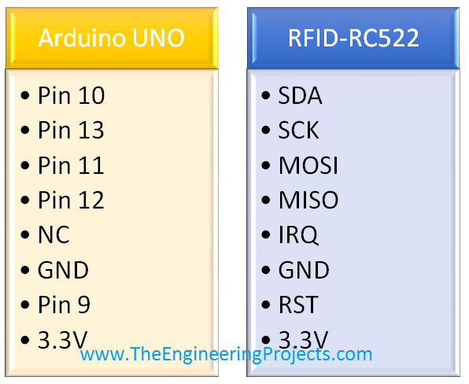

# syRFID

## Pin diag RC522 with Arduino

## Pin DIag RC522 with RPI3

## DESCRIPTION

This is a IOT based project to run the RC522 with arduino as well as Raspberry Pi.

>sharing is caring. Star this repo and encourage the coder.

>missisipi. IS is right????
